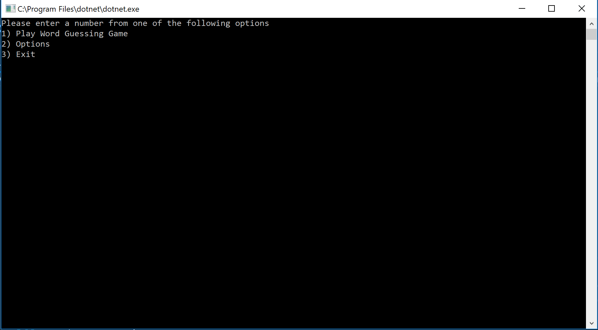
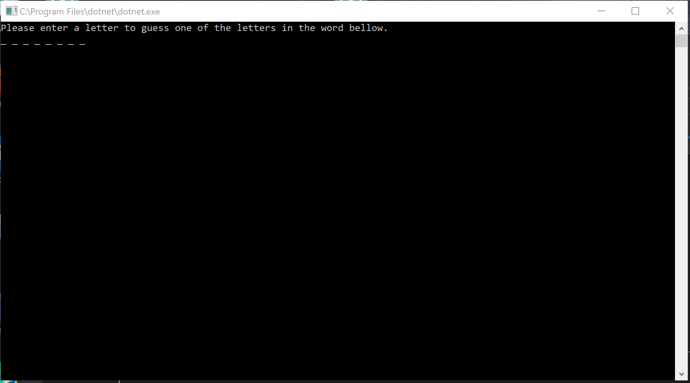
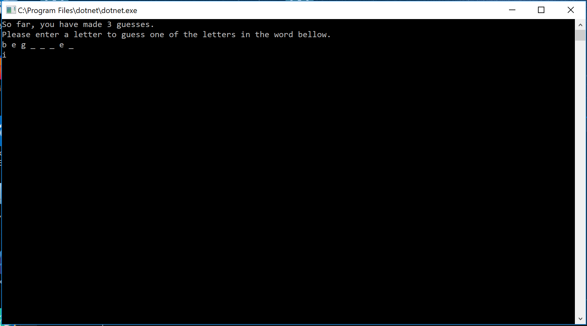
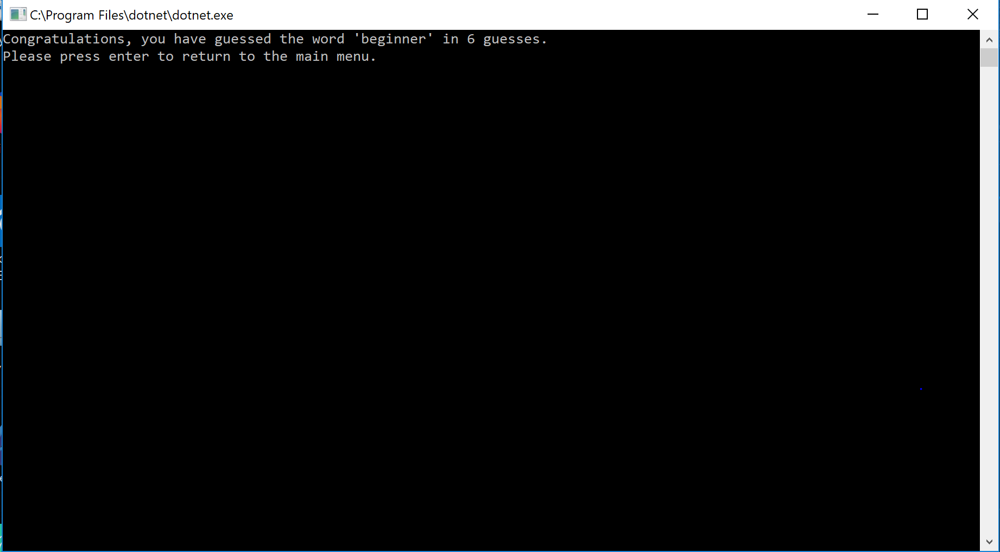
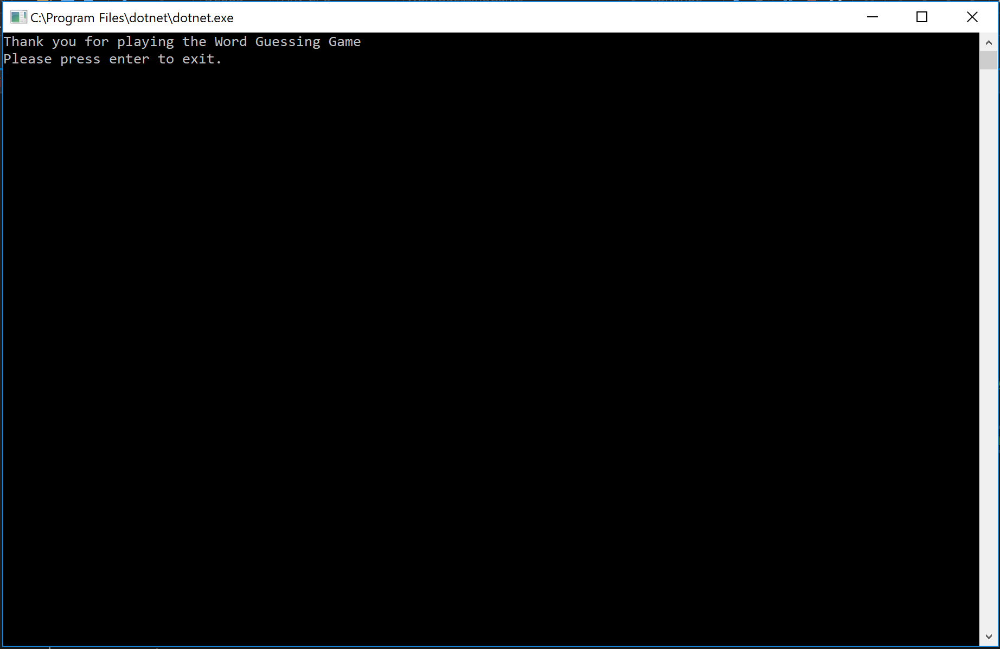
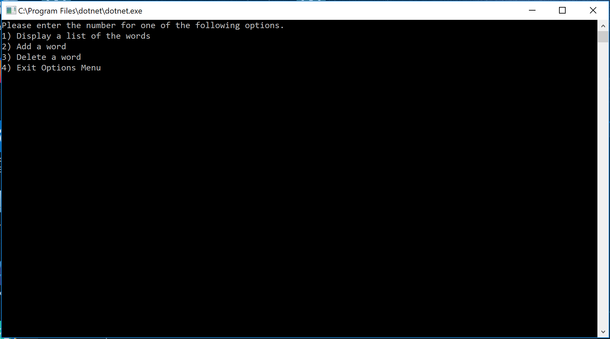
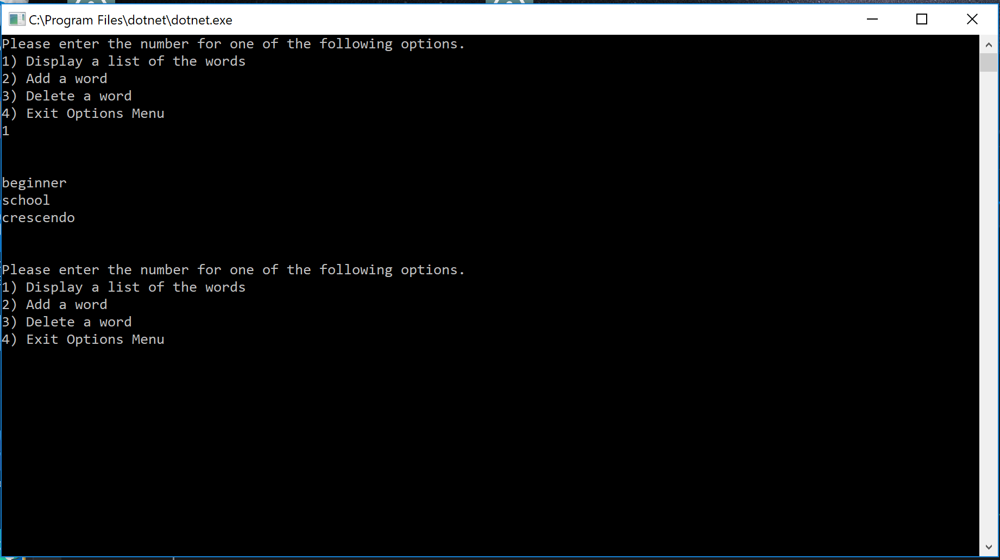
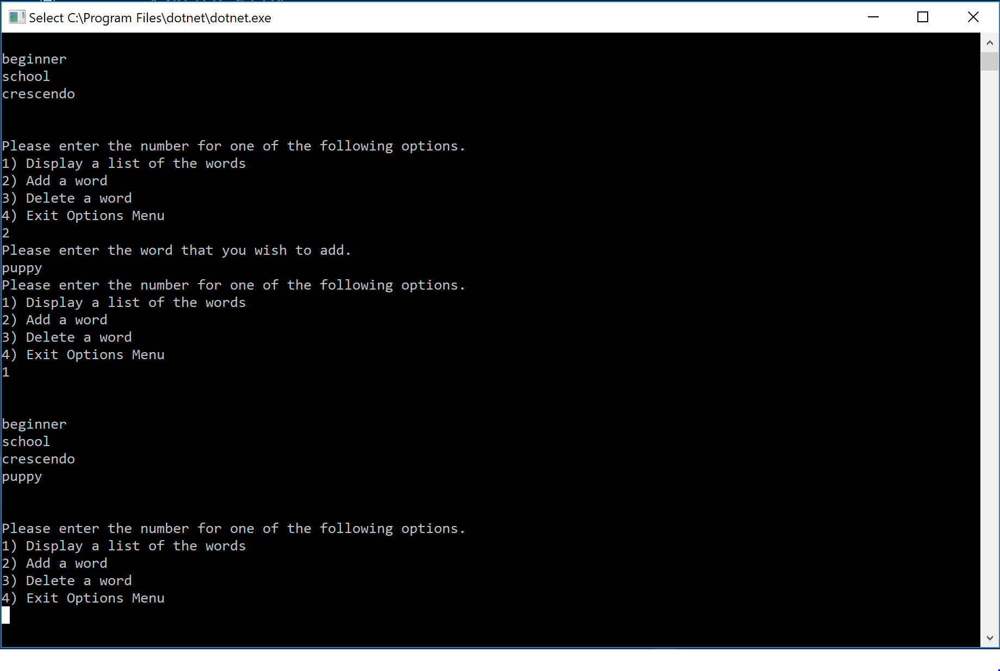
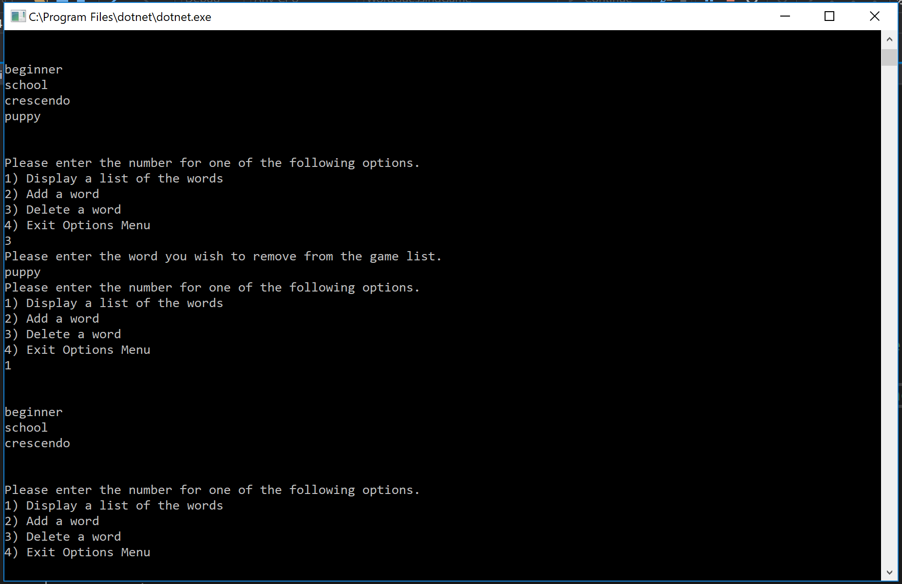

# Lab03-Word Guessing Game

------------------------------

# Word Guessing Game
#### Lab03-Word Guessing Game
##### *Author: Mike Kelly*

------------------------------

## Description
This C# program is a word guessing game on the console.  It has the user guess a word 1 letter at a time.  It also allows the user to add and remove words from the list.

------------------------------

## Getting Started
Clone this repository to your local machine.
```
$ git clone [https://github.com/Michael-S-Kelly/Lab03_Word_Guess_Game.git]
```
#### To run the program from Visual Studio:
Select ```File``` -> ```Open``` -> ```Project/Solution```

Next navigate to the location you cloned the Repository.

Double click on the ```WordGuessingGame``` directory.

Then select and open ```WordGuessingGame.sln```

------------------------------

## Visuals


##### Application Start

##### Start of Game

##### Playing Game

##### Win the Game

##### End of Game

##### Options Navigation

##### Display Words

##### Add Word

##### Delete Word


------------------------------

## Change Log
1.1 Fixed RemoveWords test...it now passes.


------------------------------
## Collaborators, Contributors, and Other Resources used

### Collaborators
#### Phil Werner
##### Chris Morton
#### Jimmy Chang

### Contributors


### Other Resources
####https://stackoverflow.com/questions/12633815/lines-of-a-streamreader-to-an-array-of-strring
####https://stackoverflow.com/questions/49853842/how-to-use-iffile-exists-statement
####https://stackoverflow.com/questions/1245243/delete-specific-line-from-a-text-file
####https://stackoverflow.com/questions/2706500/how-do-i-generate-a-random-int-number
####https://docs.microsoft.com/en-us/dotnet/api/system.random?view=netframework-4.7.2

------------------------------
For more information on Markdown: https://www.markdownguide.org/cheat-sheet